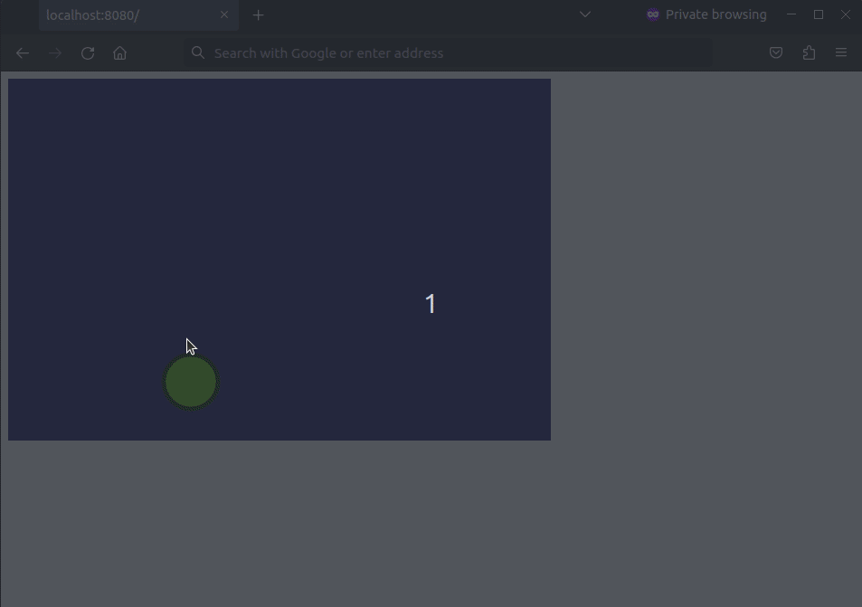

## Yampa Wasm Example

A (WIP) example of using Yampa and GHC Wasm backend to create a simple web game.



### Building

1. Enter nix flake of GHC Wasm backed with `all_9_6` flavour: 
    ```
    nix shell https://gitlab.haskell.org/ghc/ghc-wasm-meta/-/archive/master/ghc-wasm-meta-master.tar.gz#all_9_6
    ```
    To leave the flake you may call:
    ```
    exit
    ```
    If you want to setup GHC with Wasm backend without nix, follow [ghc-wasm-meta](https://gitlab.haskell.org/ghc/ghc-wasm-meta#getting-started-without-nix) guide (make sure to set the flavour to be `9.6`).

2. Inside the flake (or while having GHC with Wasm backend set up by different means), build Haskell code by:
    ```
    ./build_haskell.sh
    ```
3. Install node packages:
    ```
    npm install
    ```
4. Bundle JS code:
    ```
    npm run bundle
    ```
5. Start a local server:
    ```
    npm run serve
    ```
6. The web application should be available at http://localhost:8080/ via your browser.
